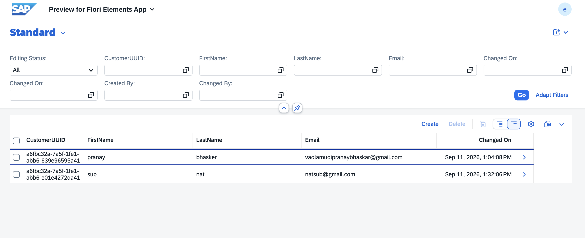
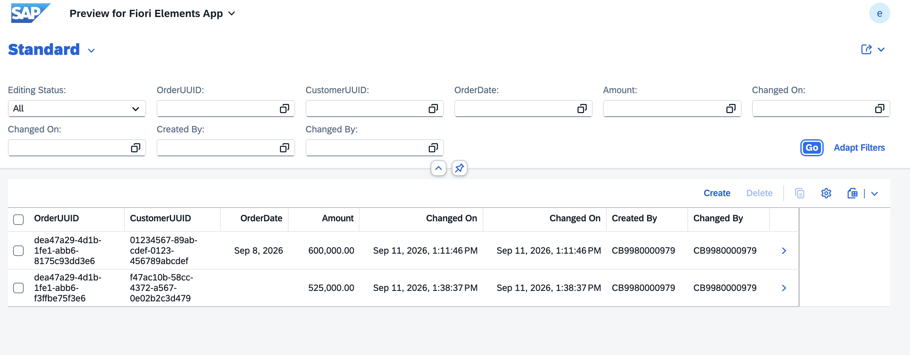

# SAP Shop RAP App

A Customer & Order management application built using SAP's RESTful ABAP Programming Model (RAP) on SAP BTP ABAP Environment, with a draft-enabled Fiori Elements UI.

## Features
- Customer and Order entities with full CRUD
- Draft handling for proper create/edit workflows
- Combined OData V4 service exposing both entities

## Customer interface

## Order interface

